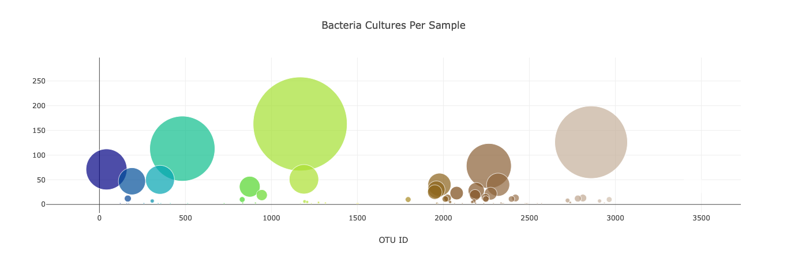
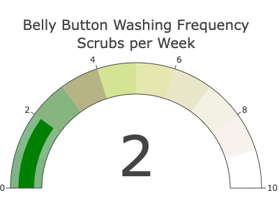

# Plotly-Belly_Button_Biodiversity

This project explains the relationship between data analytics and visualization, will use Plotly.js, a JavaScript data visualization library, to create an interactive data visualization for the web. Build an interactive dashboard using Plotly.js to explore data on the biodiversity of belly buttons.

To will keep in mind how to best convey data to volunteers and other researchers. For volunteers who are interested in selling their bacteria to Improbable Beef, what is the best way to visualize the types of bacteria that colonize their bellies? Some of them will be suitable for synthetic beef production, while others will not.
